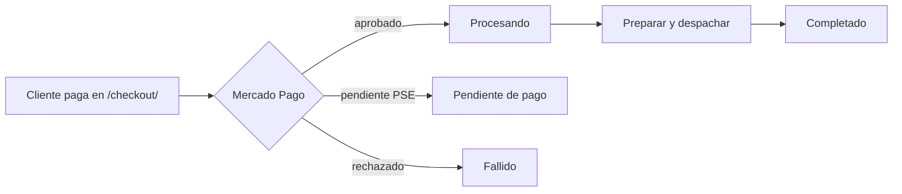

# Revisar pedidos y pagos

| Estado | Rol mínimo | Video |
|---|---|---|
| 🟡 por verificar | Gestor de tienda | `DEMOS/Pedidos-Pagos.mov` |

## Flujo de un pedido

## Pasos

1. `wp-admin` → **WooCommerce → Pedidos**.
2. Filtrar por estado **Procesando**: son los pedidos pagados que hay que despachar.
3. Abrir el pedido y revisar:
   - Productos, cantidades y **molienda** (grano / molido).
   - Dirección de envío y teléfono.
   - Nota del cliente.
4. Confirmar el pago en el panel de **Mercado Pago** si hay duda.
5. Despachar, agregar una **nota al cliente** con la guía de envío y pasar el pedido a **Completado**.

## Casos especiales

- **Pendiente de pago** (PSE): esperar la confirmación de Mercado Pago; no despachar antes.
- **Pedido por WhatsApp:** crearlo manualmente en **Pedidos → Añadir pedido** para mantener el registro.
- **Reembolso:** desde el pedido → **Reembolso** y registrar el motivo. Retracto y garantía según la
  Ley 1480 de 2011 (ver `/condiciones-del-servicio/`).
